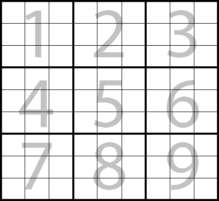

# Instructions

1. TicTac takes player and computer input as array of integer.
2. Each box is identified by a single integer, for reference look at the image below

# Rules for tests

- players take turns taking fields until the game is over. Player  always takes first move
- there are two players in the game
- a game has nine fields in a 3x3 grid
- a player can take a field if not already taken 
- a game is over when all fields in a row are taken by a player or computer
- a game is over when all fields in a column are taken by a player or computer
- a game is over when all fields in a diagonal are taken by a player or computer
- a game is over when all fields are taken

# Outcomes

- If Player wins, return a String "Player Won"
- If Computer wins, return a String "Player Lost"
- If Match is draw, return a String "Match Draw"

